<picture><source media="(prefers-color-scheme: dark)" srcset="readme-forge/stats-midnight.svg"></picture><picture><source media="(prefers-color-scheme: dark)" srcset="readme-forge/languages-midnight.svg"></picture>
<picture><source media="(prefers-color-scheme: dark)" srcset="readme-forge/activity-midnight.svg"></picture>

Cards rendered by <a href="https://github.com/furkanmeclis/readme-forge">readme-forge</a>.
